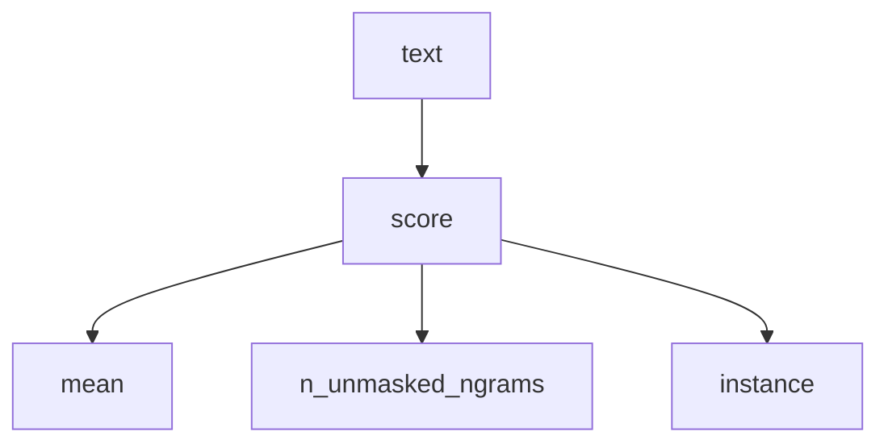

# How to use text-watermark-laboratory

This guide walks you through installing the project, running your first
measurement, and interpreting the result.

You do not need to understand the details of SynthID-Text before getting
started. The important thing to know is what this tool can — and cannot —
tell you.

text-watermark-laboratory is a research tool that runs from the command line.
It is not a website, a general AI-text detector, or a service for determining
whether a text was written by a particular model.

---

## 1. What can this tool tell me?

The main command, `score`, answers one specific question:

> How strongly does this text match DeepMind’s public 30-key SynthID-Text
> reference watermark?

The reference instance used by this project is `public-deepmind-30`.
For most users, `score` is the right place to start.

| What you want to do | What to use |
|---|---|
| Measure a text against the public DeepMind reference watermark | **`score`** |
| Determine whether a text was written by a human or by AI | Not supported |
| Determine whether a text came from Claude, ChatGPT, Grok, or another specific model | Not supported |
| Score a very short sentence or headline | Usually not meaningful; too few n-grams |
| Explore statistical watermark traces without using the official keys | `indicate`, with the limitations in [section 8](#8-key-free-experimental-scoring-with-indicate) |

A score near 0.50, when calculated from enough n-grams, means that the text
does not show a measurable bias toward **this** public key set.

It does not mean that the text was written by a human, and it does not
establish that the text contains no other watermark.

---

## 2. Requirements

You will need:

- Python 3.10 or newer
- Git
- an internet connection during the initial installation
- a few GB of free disk space
- approximately 8 GB of RAM

A GPU is not required. You also do not need an API key to use `score`.

The project is developed and tested primarily on macOS with Apple silicon.
The standard scoring path is ordinary Python with CPU JAX and is intended to
work on Linux and Windows as well, although the full test suite has not been
run on every platform here.

| Platform | `score` | Notes |
|---|---|---|
| macOS — Intel or Apple silicon | Yes | Primary development environment |
| Linux — x86_64 or ARM | Yes | Standard bash instructions apply |
| Windows with WSL2 | Yes | Recommended Windows setup; follow the Linux instructions |
| Windows native / PowerShell | Expected to work | CPU JAX supports Windows x86_64, but this setup has not been tested here |

On Debian or Ubuntu you may need `python3-venv`.

`scripts/collect_claude_premark.py --via applescript` uses AppleScript and is
macOS-only. It is a research utility and is not required to score text.

Do not install `jax[cuda]` unless you are deliberately configuring JAX for an
NVIDIA CUDA environment. The standard setup for this project uses CPU JAX.

---

## 3. Installation

Installation only needs to be done once.

### 3.1 Clone the repositories

This project depends on Google DeepMind’s public `synthid-text` repository.
The simplest setup is to clone both into the same parent directory. Do not
edit that checkout.

**macOS and Linux**

```bash
mkdir -p "$HOME/src"
cd "$HOME/src"
git clone https://github.com/jensabrahamsson/text-watermark-laboratory.git
git clone https://github.com/google-deepmind/synthid-text.git
cd text-watermark-laboratory
```

On Debian or Ubuntu, if Python’s virtual-environment support is missing:

```bash
sudo apt update
sudo apt install -y python3 python3-venv python3-pip git
```

**Windows with WSL2**

Install [WSL2](https://learn.microsoft.com/en-us/windows/wsl/install) and
Ubuntu, open the Ubuntu terminal, and follow the macOS/Linux instructions
above. Paths look like `/home/you/src/...`, not `C:\...`.

**Windows native / PowerShell**

Install [Git for Windows](https://git-scm.com/download/win) and
[Python 3.10+](https://www.python.org/downloads/windows/). When installing
Python, enable **Add python.exe to PATH**. Then:

```powershell
New-Item -ItemType Directory -Force -Path "$env:USERPROFILE\src" | Out-Null
Set-Location "$env:USERPROFILE\src"
git clone https://github.com/jensabrahamsson/text-watermark-laboratory.git
git clone https://github.com/google-deepmind/synthid-text.git
Set-Location text-watermark-laboratory
```

If you already have the repositories elsewhere, adjust the paths below.

### 3.2 Create a virtual environment

A virtual environment keeps this project’s packages separate from the rest of
your system.

**macOS, Linux, and WSL**

```bash
python3 -m venv .venv
source .venv/bin/activate
python -m pip install -U pip
```

**Windows PowerShell**

```powershell
python -m venv .venv
.\.venv\Scripts\Activate.ps1
python -m pip install -U pip
```

If PowerShell reports that scripts are disabled:

```powershell
Set-ExecutionPolicy -Scope CurrentUser RemoteSigned
```

Then activate the environment again. Alternatively, from Command Prompt:

```text
.venv\Scripts\activate.bat
```

Once activated, the prompt should normally begin with `(.venv)`. Activate
again whenever you open a new terminal.

```bash
# macOS, Linux, or WSL
cd "$HOME/src/text-watermark-laboratory"
source .venv/bin/activate
```

```powershell
# Windows PowerShell
Set-Location "$env:USERPROFILE\src\text-watermark-laboratory"
.\.venv\Scripts\Activate.ps1
```

### 3.3 Install the project and SynthID-Text

The project uses CPU JAX. DeepMind’s package declares CUDA-related
dependencies that are not required here, so we install this project first and
then attach the `synthid-text` checkout without its dependencies:

```bash
pip install -e ".[jax-cpu,dev]"
pip install -e "$HOME/src/synthid-text" --no-deps
```

If you cloned `synthid-text` somewhere else, replace `$HOME/src/synthid-text`
with that path.

The project pins **`transformers==4.57.6`**. That is intentional.
Transformers 5.x can cause GPT-2 generation with the SynthID mixin to stop
early at EOS. We do not install DeepMind’s older `4.43.3` pin; a compatibility
shim in `generate.py` lets the mixin work with 4.57.6.

### 3.4 Verify the installation

```bash
python -m pytest tests/ -q
```

A successful run should end with something similar to `47 passed`. The first
run may take longer because the GPT-2 tokenizer needs to be downloaded.
PyTorch `vmap` warnings during the tests are expected.

If the tests fail, see [Troubleshooting](#11-troubleshooting).

---

## 4. Run your first measurement

The repository includes known marked and unmarked examples.

Make sure the virtual environment is active, then run:

```bash
python -m text_watermark_tools score \
  experiments/2026-08-17-pair-12x4/01-harbour-marked.txt
```

You should see output similar to:

```text
experiments/2026-08-17-pair-12x4/01-harbour-marked.txt: mean=0.623224 weighted_mean=0.641979 n_tokens=126 n_unmasked_ngrams=122 instance=public-deepmind-30 ngram_len=5
```

This example was generated with the public SynthID-Text mixin. Its mean is
therefore clearly above the chance baseline of approximately 0.50.

Now score its unmarked twin. It was generated from the same prompt, without
the watermark mixin:

```bash
python -m text_watermark_tools score \
  experiments/2026-08-17-pair-12x4/01-harbour-unmarked-gen.txt
```

```text
... mean=0.508333 weighted_mean=0.508295 ... n_unmasked_ngrams=124 instance=public-deepmind-30 ...
```

Finally, score the original seed prompt:

```bash
python -m text_watermark_tools score \
  experiments/2026-08-17-grok-prompts/01-harbour.txt
```

```text
... mean=0.500000 weighted_mean=0.497516 ... n_unmasked_ngrams=273 instance=public-deepmind-30 ...
```

| File | Typical mean |
|---|---|
| Known marked sample | approximately 0.61–0.65 |
| Unmarked comparison | approximately 0.50 |
| Original prompt | approximately 0.50 |

If your results are close to these values, the scorer is working as expected.

---

## 5. Understanding the output

| Field | Meaning |
|---|---|
| `mean` | The official DeepMind mean for this watermark instance. This is the primary measurement |
| `weighted_mean` | A weighted version of the same measurement; a secondary reference |
| `n_tokens` | Number of tokens processed |
| `n_unmasked_ngrams` | Number of 5-grams actually included in the measurement |
| `instance=public-deepmind-30` | Identifies the key set being tested |
| `ngram_len=5` | The n-gram window size used by this instance |

Always read the score together with the number of usable n-grams.

| Result | Reasonable interpretation |
|---|---|
| `mean` around 0.60–0.65 with hundreds of usable n-grams | Strong bias toward this public watermark instance |
| `mean` around 0.50 with many usable n-grams | No measurable bias toward this public key set |
| `mean=nan`, `n_unmasked_ngrams=0` | Not enough text to calculate a meaningful score |
| `mean=0.53` with only 20 usable n-grams | Too little evidence; likely noise |
| Claude, ChatGPT, or another vendor’s text around 0.50 | Expected; this public key set is not their detector |

There is no universal threshold in the code. In these experiments, a value
clearly above 0.50, supported by a substantial number of n-grams, is treated
as evidence of bias toward the tested public key set. That interpretation
applies to this experimental setup and this key set.

### Very short texts

```bash
printf 'Hello.\n' > /tmp/short.txt
python -m text_watermark_tools score /tmp/short.txt
```

```text
/tmp/short.txt: mean=nan weighted_mean=nan n_tokens=3 n_unmasked_ngrams=0 instance=public-deepmind-30 ngram_len=5
```

This is not a negative result. There is not enough text to construct the
required 5-gram windows. Use several paragraphs rather than a headline.

---

## 6. Score your own text

### Option A — a text file

This is the recommended method. Save the text as a UTF-8 plain-text file
(for example `text.txt`). If the source is Word or another document format,
export or copy the actual text into a `.txt` file first.

```bash
source .venv/bin/activate
python -m text_watermark_tools score /full/path/to/text.txt
```

On macOS, drag a file from Finder into the Terminal window to insert its
full path. On Windows PowerShell, quote paths that contain spaces:

```powershell
python -m text_watermark_tools score "C:\Users\you\Desktop\text.txt"
```

### Option B — clipboard contents

```bash
# macOS
pbpaste | python -m text_watermark_tools score
```

```bash
# Linux (X11)
xclip -selection clipboard -o | python -m text_watermark_tools score
```

```bash
# Linux (Wayland)
wl-paste | python -m text_watermark_tools score
```

```powershell
# Windows PowerShell
Get-Clipboard | python -m text_watermark_tools score
```

The input is labelled `stdin`; the measurements are otherwise the same. If
`xclip` or `wl-paste` is missing, use a file instead (Option A).

### Option C — a directory

```bash
python -m text_watermark_tools score /full/path/to/folder
```

One result per `.txt` file. Subdirectories are not searched recursively.

### Choosing a tokenizer

The default tokenizer is GPT-2, which matches the bundled experiments.

```bash
python -m text_watermark_tools score path/to/T.txt --model gpt2
```

The tokenizer matters because different tokenization changes the n-gram
boundaries and therefore the measurements. Using a different tokenizer does
not change the watermark keys, but it does make the score unsuitable for
direct comparison with measurements produced using another tokenizer.

If you do not know which tokenizer was used during generation, leave the
default and interpret the result accordingly.

---

## 7. Optional control using shuffled keys

The scorer can run a sanity check against a shuffled dummy key set.

```bash
python -m text_watermark_tools score \
  experiments/2026-08-17-pair-12x4/01-harbour-marked.txt \
  --control-shuffled-keys
```

```text
... mean=0.623224 ... instance=public-deepmind-30 ...
... mean=0.499180 ... instance=control-shuffled-30 ...
```

The same text scores highly against the correct public key set and
approximately 0.50 against the shuffled control. Always check the `instance=`
field. `control-shuffled-30` is an experimental control, not a detector for
another model or vendor.

---

## 8. Key-free experimental scoring with `indicate`

`indicate` is a **possible / weak indicator**. It is fundamentally different
from `score`. Do not treat `indicate` as `score`.

`score` uses the public DeepMind reference keys. `indicate` does not. It
compares token statistics with reference tables built from paired GPT-2
generations produced with and without the watermark mixin.

The test of that indicator is **leave-one-out**: train count tables on all
twin prompts except one (`indicate holdout --rotate`) and score the held-out
text alone. Do not train on the Claude pre-mark pile alone. Claude
leave-one-out waits for same-prompt marked reruns.

```bash
python -m text_watermark_tools indicate score path/to/T.txt \
  --tables experiments/indicator-gpt2
```

The result contains an `lr=` value (likelihood ratio). A positive value means
that the sample is statistically more similar to the marked side of the
particular GPT-2 corpus used to construct the tables.

Do not interpret this as a general watermark verdict.

Current held-out results: **29 / 48** marked files received `lr > 0`.
Mean LR on marked files: **+0.033**. Mean LR on unmarked files: **−0.003**.
The two distributions overlap substantially.

`indicate` can show a statistical tendency across samples. It is not reliable
enough to classify an arbitrary individual text as marked or unmarked.

`--margin 0.02` changes the tolerance used in the experiment. It does not
make the statistical model stronger or turn it into an official detector.

For ordinary use, start with `score`.

The tables under `experiments/indicator-gpt2/` were trained on all 12
laboratory prompts. Scoring those same training samples is not held-out
validation. The corresponding held-out experiment is
[experiments/2026-08-17-indicate-holdout-12x4/](experiments/2026-08-17-indicate-holdout-12x4/).

---

## 9. Research commands

These commands reproduce or extend the experiments. You do not need them
simply to score a text.

| Command | Purpose |
|---|---|
| `pair` | Generate matched GPT-2 outputs from the same prompt, mixin on and off |
| `blind` | Key-free leave-one-prompt-out evaluation on the paired samples |
| `indicate fit` / `holdout` | Build or leave-one-out evaluate the possible / weak token-count indicator (twins only; not the Claude pre-mark pile) |
| `iterate` | Rewrite a known-marked sample; official-score every pass. `--via polish` is the light-edit control. `--stop-on indicate` is not official `score`. Not a remover |
| `experiment` | Older generate → rewrite → reference-score workflow |
| `scripts/collect_claude_premark.py` | Historical Claude research corpus |

`iterate` is an experimental measurement workflow. It is **not a remover**.
`--via polish` asks only for small lexical edits so the text “sounds better”
(the control). Default `--via paraphrase` is the substantial rewrite.
`--stop-on indicate` stops when the key-free single-file LR is at or below
`--indicate-threshold`; official mean and weighted mean are still recorded
every pass. That stop is **not** official `score`.

Some research commands use external APIs. Store credentials in the local
configuration files `DASHSCOPE-KEY.conf` and `DEEPSEEK-KEY.conf` (example
files are in the repository). Those files should remain gitignored. Never
put API keys on the command line or commit them to Git.

---

## 10. What about Claude, ChatGPT, Grok, or other AI systems?

The public DeepMind key set is not a universal SynthID detector. Even if
another provider uses SynthID-Text or a related method, that does not mean
they use the same secret keys as `public-deepmind-30`.

- A Claude text scoring approximately 0.50 against this instance does not
  establish that Claude output is unwatermarked.
- A ChatGPT text scoring approximately 0.50 does not establish that it was
  written by a human.
- Grok-written prompts in this repository score around the baseline because
  they were not generated with this project’s public GPT-2 watermark mixin.

Other techniques sometimes called “watermarks” are also out of scope:
invisible Unicode characters, metadata-based provenance, C2PA, image
watermarking, and other SynthID modalities.

If the question is “was this paragraph written by AI?”, this repository
cannot answer it.

---

## 11. Troubleshooting

| Problem | Likely cause | Solution |
|---|---|---|
| `command not found: python` | Virtual environment inactive, or Python missing | Activate `.venv`; verify Python 3.10+ |
| `python3: not found` on Windows | Native Windows normally uses `python` | `python --version`, then `python -m venv .venv` |
| `Activate.ps1` cannot be loaded | PowerShell execution policy | `Set-ExecutionPolicy -Scope CurrentUser RemoteSigned` |
| JAX/DLL error on native Windows | Missing VC++ runtime | Install the [VC++ redistributable](https://learn.microsoft.com/en-us/cpp/windows/latest-supported-vc-redist) or use WSL2 |
| `No module named text_watermark_tools` | Environment inactive or project not installed | Activate `.venv`, then `pip install -e ".[jax-cpu,dev]"` |
| `No module named synthid_text` | DeepMind checkout not installed | `pip install -e /path/to/synthid-text --no-deps` |
| JAX/CUDA errors on macOS | CUDA JAX was installed accidentally | Remove it and use the `jax-cpu` extra |
| Failure inside mixin `_sample` / `streamer` | Incompatible Transformers version | `pip install 'transformers==4.57.6'` |
| `mean=nan` | Too little text for a 5-gram measurement | Use a longer sample |
| First run appears to pause | Tokenizer is being downloaded | Wait for the initial Hugging Face download |
| Claude text scores around 0.50 | Wrong watermark instance | This tool does not contain Claude’s detector keys |
| `indicate` gives an LR near zero or the unexpected sign | Single-file key-free signal is weak | Do not use `indicate` to override `score` |

Rerun the test suite at any time:

```bash
source .venv/bin/activate
python -m pytest tests/ -q
```

---

## 12. Common interpretation mistakes

- Do not interpret a score around 0.50 as evidence that a text was written
  by a human.
- Do not describe this project as a Claude, ChatGPT, or general AI detector.
- Do not interpret `indicate` as an official key-free SynthID detector.
- Do not describe `iterate` or rewriting experiments as a general
  watermark-removal tool.
- Do not put API credentials on the command line or commit them to Git.
- Do not install CUDA JAX on systems that do not have the appropriate
  NVIDIA CUDA environment.
- Do not modify the DeepMind `synthid-text` checkout as part of a normal
  installation. Use `pip install -e … --no-deps`.

The most important distinction:

`score` measures a text against one known public SynthID-Text key set. It
does not determine who or what wrote the text.

---

## 13. Where to go next

If you have installed the project and run `score`, you already have the
basic workflow:



For most users those three values are the important ones:

1. Check `mean`.
2. Make sure there are enough `n_unmasked_ngrams`.
3. Confirm that `instance=public-deepmind-30`.

If you want to understand or reproduce the research:

- [research/key-free-twins.md](research/key-free-twins.md) — why the paired-generation experiments exist
- [research/how-synthid-works.md](research/how-synthid-works.md) — how SynthID-Text works
- [research/claude.md](research/claude.md) — notes on the Claude / SynthID timeline
- [README.md](README.md) — project overview and current findings
- [experiments/README.md](experiments/README.md) — experiment documentation

Results should be interpreted as measurements under documented experimental
conditions, not as universal claims about AI-generated text or watermarking.
