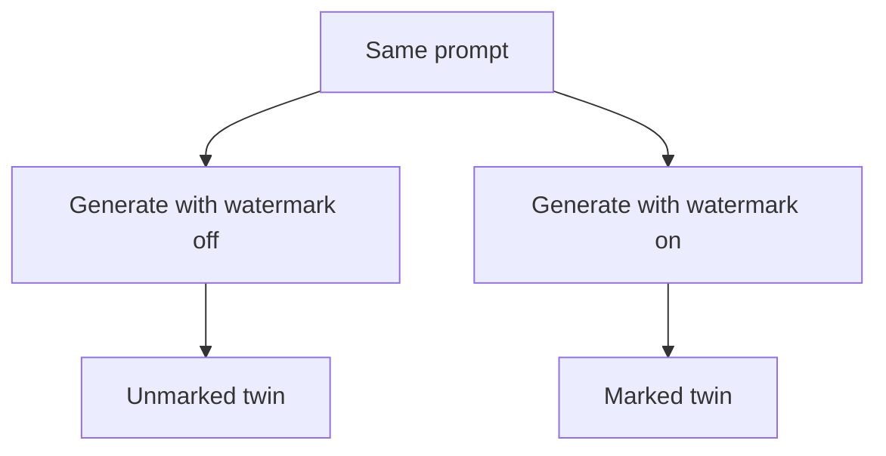
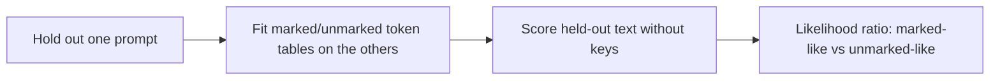

# text-watermark-laboratory

**text-watermark-laboratory** explores a practical question about statistical text watermarks:

> **Can we tell whether text carries a watermark even when we do not have the detector keys?**

For the experimental setup in this repository, the answer is **yes — to a useful but still limited degree**.

Using Google DeepMind's public SynthID-Text implementation as a controlled reference, we generate matched marked and unmarked text from the same prompts. From those pairs we have built a **key-free watermark indicator**: a model that can score previously unseen text by how strongly its token statistics resemble the marked rather than the unmarked class, without using the watermark keys, `hash_iv`, or g-values.

The clean headline for the original last-4 count tables is **10/12 held-out prompt groups**: after training on the other eleven prompt families, the marked side of the twelfth ranks above its unmarked twin group. That is **relative discrimination**, not “here is one unknown file; marked yes/no?”. A 0.02 comparison margin lifts *that same scorer* to 11/12; that is a robustness check, not the main result.

Scoring only 4-grams seen on both training sides (`hits`) reaches **11/12** with no margin and file-level AUC **0.737**. Feature-hashing those contexts (`hashpool`) reaches **11/12** and **35/48** isolated marked files with `lr > 0` (binomial p ≈ 0.001). The original hard sign at 0 remains weak under leave-one-of-12-out: **29/48**. Train the same hits reader on 24 *other* GPT-2 topics and the 12×4 files score **39/48** (AUC **0.769**). Train on 12×4 and score 24 new topics: hits ranks **24/24** (AUC **0.986**), with unmarked specificity at 0 only 14/24. There is a transferable held-out signal. It is not a magic detector, and this lab did not invent key-free watermark detection.

This repository also contains the ordinary key-based reference scorer, matched-pair generation, rewrite/degradation experiments, and a pre-mark Claude corpus for future before/after comparison.

Install and run your first measurement: **[HOW-TO.md](HOW-TO.md)**  
Research notes: **[research/](research/)**  
Coding-agent instructions: **[AGENTS.md](AGENTS.md)**

---

## What we found

The key result is not merely that watermarked text leaves “some statistical trace”. Tournament sampling leaves a **secondary, learnable footprint** in next-token counts. A very simple model — context/token tables plus a likelihood ratio, no keys, no `hash_iv`, no g-values — can pick that footprint up. The code enforces the claim: `BlindModel` carries `used_keys`, `used_hash_iv`, and `used_g_values`, the held-out decision never consults `detector_mean`, and `indicate` refuses to persist a table that says those flags are true.

That still leaves two different tasks.

**Relative discrimination (the 10/12 number).** Leave one prompt family out. Fit marked and unmarked count tables on the rest. Score the held-out marked generations and the held-out unmarked generations. Count a hit if the marked group’s mean LR is higher than the unmarked group’s. Four draws and last-4 context with the original hard scorer: **10/12**. `--margin 0.02` lets the unmarked side win by up to 0.02 and still count as a marked win; that is how one **11/12** appears. Quote **10/12** for that scorer. Treat the 0.02-margin 11/12 as a tolerance note.

A different reader of the same tables — score only 4-grams seen on both training sides (`hits`) — reaches **11/12** with no margin, file-level AUC **0.737**. Feature-hashing those 4-grams (`hashpool`) is also **11/12**. Those 11/12 figures are new methods, not the 0.02 fudge.

**Single-text classification (the 29/48 number).** Same leave-one-out tables, but decide from the sign of one file’s LR against 0, with no twin. Hard last-4 marked `lr > 0`: **29/48**. Unmarked `lr ≤ 0`: **23/48**. The two distributions overlap (mean marked LR +0.033, unmarked −0.003). Binomial P(≥29 | n=48, p=0.5) = 0.097, so that sign is not a 5% test. Ranking of the same LRs is (AUC 0.626, permutation p = 0.0075). Hashpool’s isolated sign is **35/48** (p ≈ 0.001), with unmarked specificity still 29/48.

When the tables are trained on **other prompt families** (24 stems from the 36-topic corpus, none of harbour/night-bus/…), hits on the 12×4 files is **39/48** marked `lr > 0` (AUC **0.769**). The reverse — train 12×4, test 24 new topics — ranks every marked file above its unmarked twin (hits **24/24**, AUC **0.986**). That ranking is not a calibrated detector: ten unmarked twins are also positive at threshold 0. The 29/48 figure is the leave-one-of-12-out hard scorer, not the best isolated-file protocol this lab now has.

| Method | What is being asked | Result |
|---|---|---|
| Official `score` | Public DeepMind keys, 12 matched prompts | **12/12** |
| Key-free, 1 sample | Twin ranking, 12 × 128 tokens | **8/12** |
| Key-free, 4 samples, last-4 | Twin ranking of held-out prompt groups | **10/12** |
| Same LRs, margin 0.02 | Same ranking, unmarked may lead by 0.02 | 11/12 (not the headline) |
| Key-free `hits` (shared 4-grams only) | Same 12×4 twins, skip unseen contexts | **11/12**, AUC **0.737** |
| Key-free hashpool | Feature-hashed last-4, no secret hash | **11/12**, isolated **35/48** |
| Key-free hashpool, 36 topics | Same method, one draw per prompt | **31/36**, AUC **0.877** |
| Key-free hashpool, Qwen 12×1 | Different generator, last-4 hashpool | **10/12**, isolated **11/12** |
| Key-free hits, other topics → 12×4 | Train 24 new stems, score 12×4 files | isolated **39/48**, AUC **0.769** |
| Key-free hits, 12×4 → 24 new topics | Train 12×4, score stems 13–36 | **24/24** ranking, AUC **0.986** |
| Local Qwen2-1.5B, last-2 | Twin ranking, published count tables | **10/12** |
| `indicate` hard, one marked file | Isolated `lr > 0`, leave-one-of-12-out | **29/48** |
| `indicate` hard, one unmarked file | Isolated `lr ≤ 0` | **23/48** |
| Argmax snap, then official `score` | Key-free scrub of 48 marked files | **0.622 → 0.499** |

So `indicate` is an experimental watermark-presence indicator. It is not a universal verdict machine, and 10/12 must not be read as single-text accuracy.

`probe` compares other key-free scorers on the same twins (interpolation, coverage gating, hash pooling, optional unmarked-LM choice geometry) and reports AUC as well as prompt-grain wins. `scrub` tries to remove a known public mark by snapping tokens to the unmarked argmax. Neither reconstructs keys.

Detailed protocol and results: [research/key-free-twins.md](research/key-free-twins.md) and [research/key-free-probe.md](research/key-free-probe.md).

---

## The controlled experiment

SynthID-Text does not insert hidden characters or metadata. The watermark changes **which next tokens are selected during generation**.

That makes a paired experiment possible:



With the public keys available, DeepMind's detector confirms that the mark is present:

```text
unmarked ≈ 0.50
marked   ≈ 0.61–0.65
```

For the key-free experiment, those official scores are not used to make the decision:



The experiment therefore asks a harder question than ordinary detection: **is there enough structure in the sampler's output to infer watermark presence without reproducing the detector?**

For held-out *groups*, yes (10/12 hard last-4; 11/12 with `hits` or `hashpool`). For one file’s hard sign at 0 under leave-one-of-12-out, not reliably (29/48). Out-of-family hits is stronger (39/48 on 12×4; 24/24 ranking on new topics) but still not a universal detector. Hashpool’s in-family isolated sign is 35/48.

---

## Commands

```bash
source .venv/bin/activate
python -m pytest tests/ -q

# Key-based reference score
python -m text_watermark_tools score path/to/text.txt

# Generate marked/unmarked twins
python -m text_watermark_tools pair experiments/2026-08-17-grok-prompts \
  --out-dir experiments/pairs --max-new-tokens 128

# Key-free leave-one-out experiment
python -m text_watermark_tools blind experiments/pairs \
  --out-dir experiments/blind

# Evaluate the key-free indicator
python -m text_watermark_tools indicate holdout experiments/2026-08-17-pair-12x4 \
  --rotate --context-len 4

# Fit reusable tables and score a file
python -m text_watermark_tools indicate fit experiments/2026-08-17-pair-12x4 \
  --out-dir experiments/indicator-gpt2 --context-len 4

python -m text_watermark_tools indicate score path/to/text.txt \
  --tables experiments/indicator-gpt2

# Hashpool tables (usable 35/48 reader) and out-of-family transfer
python -m text_watermark_tools indicate fit experiments/2026-08-17-pair-12x4 \
  --method hashpool --out-dir experiments/indicator-gpt2-hashpool

python -m text_watermark_tools indicate score path/to/text.txt \
  --tables experiments/2026-08-31-transfer-36-to-12x4/tables-hashpool

python -m text_watermark_tools probe experiments/2026-08-17-pair-36 \
  --test-dir experiments/2026-08-17-pair-12x4 \
  --overlap drop-from-train \
  --out-dir experiments/transfer

# Compare key-free scorers (AUC + prompt-grain wins)
python -m text_watermark_tools probe experiments/2026-08-17-pair-12x4 \
  --out-dir experiments/probe
```

`score` and `indicate` answer different questions:

- `score` reproduces the public DeepMind detector for the known `public-deepmind-30` instance.
- `indicate` asks whether text statistically resembles the marked or unmarked side of a learned corpus **without those keys**.

---

## Reference scoring

The repository uses DeepMind's published 30-key reference configuration:

```text
instance=public-deepmind-30
ngram_len=5
```

A sufficiently long text near 0.50 shows no measurable bias toward **that key set**. A marked sample generated with the same public mixin typically scores around 0.61–0.65 in our runs.

This is a controlled research baseline. It is not a general human-vs-AI classifier.

---

## Rewriting experiments

The lab can also take a sample known to be marked under the public instance, rewrite it, and measure what happens to the signal.

Earlier measurements include:

- marked GPT-2 text: **0.617 / 0.638**
- light Sonnet proofread: **0.605 / 0.625**
- full Sonnet rewrite: **0.502 / 0.502**
- Qwen rewrite of a known marked sample: approximately **0.50**

These experiments measure how a known watermark behaves under transformation. They are not needed for the key-free indicator itself.

---

## Claude

Anthropic has announced text marking based on "a version of" SynthID-Text. Their production keys and detector are not public.

That makes Claude interesting for a different reason: it provides a future real-world test of the key-free method.

The repository contains a **pre-mark corpus** in `experiments/claude-premark-2026-08/`. Once a comparable marked corpus exists, the same prompts can be rerun and the before/after shift can be measured without pretending that DeepMind's public keys are Claude's keys.

See [research/claude.md](research/claude.md) and [research/paired-corpus.md](research/paired-corpus.md).

---

## Related work

This lab did **not** invent key-free watermark detection.

[TTP-Detect](https://arxiv.org/abs/2603.14968) (*Rethinking LLM Watermark Detection in Black-Box Settings*) formulates third-party, key-agnostic verification from observable outputs and paired watermarked/unwatermarked reference sets — the same audit problem, a different method. Earlier watermark-stealing and probing work learns structure from black-box samples. [ETH/SRI’s SynthID probe](https://www.sri.inf.ethz.ch/blog/probingsynthid) ([Sabanayagam, Hörl, Dobriban 2024](https://arxiv.org/abs/2405.20777)) shows that SynthID-Text can be detected as a *generator property* with repeated fixed-context queries. That is not the same measurement as scoring a finished string against count tables.

What this repository adds is a small, fully checked-in instance of the second measurement on DeepMind’s **public** mixin: GPT-2 and Qwen twins, leave-one-out, a frozen indicator table, tests, and raw JSON. The interesting claim is narrow. The keyed tournament leaves a distributional footprint that a count-based LR can learn **without reconstructing the g-function**. Independent work landed in the same research question; treat this as an empirical notebook, not a priority claim.

If the 10/12 ranking is a confound (topic reuse, tokenizer mismatch, prompt-family leakage), that is the thing to break. Extra draws of the *same* prompt helped last-4 **for the hard scorer**. Extra topics, by themselves, did not help that scorer (20/36). Coverage gating and hash pooling later showed that extra topics *do* help once unseen 4-grams are not dumped into the unigram (30–31/36).

## Boundaries

The current results support a specific claim:

> **On this public mixin, matched twins leave enough key-free statistical structure that a count-based indicator can rank most held-out prompt groups.**

They do not establish invention of the problem, reliable classification of every isolated paragraph, recovery of secret keys, or equivalence between `public-deepmind-30` and production systems from other vendors.

Those are different questions.

---

## Project layout

```text
AGENTS.md        coding-agent instructions
HOW-TO.md        installation and practical usage
research/        methods and research notes
experiments/     dated runs and result artifacts
src/             score, pair, blind, indicate, iterate
```

The project depends on [`google-deepmind/synthid-text`](https://github.com/google-deepmind/synthid-text) but is not a fork.

Licensed under [MIT](LICENSE).
