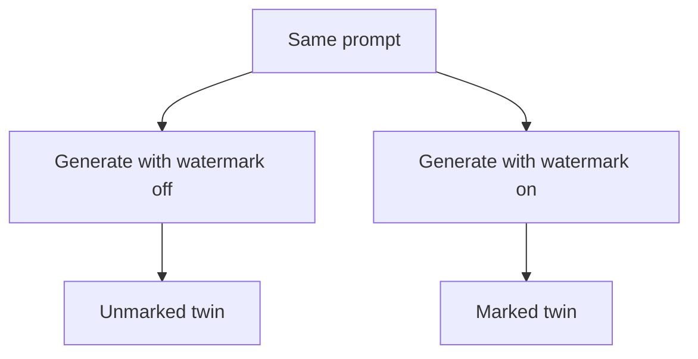
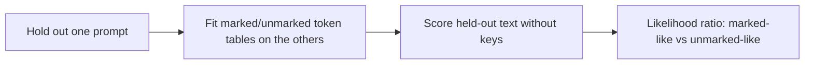

# text-watermark-laboratory

Jens Abrahamsson, Master of Science.

## Abstract

We have built an empirical indicator for watermark presence **without the detector keys**: a frozen count-table likelihood ratio that ranks held-out **prompt groups** on Google DeepMind's public SynthID-Text instance (`public-deepmind-30`). The method is key-free, not reference-free: the auditor holds matched marked and unmarked twins, not the g-function. The empirical claim is a two-grain **population** result, not a universal isolated-file detector. Held-out prompt groups rank **9/12** (original 12-LOO hard last-4), **36/36** (in-domain 36×4 hits), and **99/100** (confirmatory lock A). Isolated sign of one original-12 file at `t=0` is **25/48**. Official keyed `score` is already **12/12**; that is the positive control, not this result. Occupancy-free isolated recall on named opening readers is bounded by opening-atom overlap. This is not a universal isolated-file detector, not key recovery, and not a refutation of Christ et al. (2024) or Zhang et al. (2024). Closest published finished-string paired-reference analog: Wang et al. (2026). Isolated-file research is not finished. Locked wording: [research/abstract.md](research/abstract.md).

**text-watermark-laboratory** asks a practical question about statistical text watermarks:

> **Can we tell whether text carries a watermark even when we do not have the detector keys?**

On Google DeepMind's public SynthID-Text mixin (`public-deepmind-30`), with matched marked/unmarked twins: **yes, at prompt-group grain; not as a universal isolated-file detector.** Tournament sampling leaves a learnable footprint in next-token counts. A count-table likelihood ratio picks that up without keys, `hash_iv`, or g-values. This lab did not invent that research question.

| | Claim | Number | Not |
|---|---|---|---|
| 1 | Key-free last-4 count tables rank held-out prompt groups | **9/12** | Single-file accuracy |
| 2 | Same hits reader, 36 topics × 4 draws, in-domain | **36/36** | Cross-generator |
| 3 | Isolated hard sign, one marked file, `lr>0` | **25/48** | A 5% binomial test; not a calibrated detector |
| 4 | Frozen lock A on 100 new GPT-2 families | **99/100** | Isolated-file detector; not Distil/Qwen |

Official keyed `score` on the original 12 twins is **12/12**. That path uses keys. It is the positive control.

**Mechanistic finding.** Scoring the first four generated tokens already ranks **34/36** in-domain, matching a 16-token prefix: an opening is **sufficient** on that corpus. Truncated last-k contexts used to be stored `context_len` times; that overcount inflated the published **10/12** / **29/48**. After storing each real suffix once, prompt ranking is **9/12** (or **10/12** with margin 0.02) and isolated hard sign is **25/48**. In-domain 36×4 hits is still **36/36**. PROTOCOL-next H2 (**0:4** **99/100** vs **16:32** **89/100**) is a **reindexed** window measurement until rerun with absolute history; do not read it as “the signal does not accumulate.” File-level permutation p = 0.040 on the original 12 is descriptive; the inferential unit is the prompt family. Occupancy-free isolated recall on named opening observed-token readers is bounded by opening-atom overlap.

Ablations, hashed readers, rank-path, occupancy, and transfer tables: **[research/results-ledger.md](research/results-ledger.md)** and **[experiments/README.md](experiments/README.md)**. Later 39/48 and 41/48 figures on the same 12×4 files are hypothesis generators (occupancy, in-domain geometry, researcher reuse of one evaluation set). They do not replace **25/48**.

The confirmatory measurement on 100 new GPT-2 prompt families is in: **[research/PROTOCOL-next.md](research/PROTOCOL-next.md)**. Lock A (interpolate last-4) ranks **99/100** prompt groups. Isolated `lr>0` is still not the primary endpoint. DistilGPT2 Phase B official lamp is **70/100**; opening poshits **88/100** (1 tie); rankpath **68/100** (1 tie). Qwen2-1.5B official lamp is **100/100**; opening poshits **95/100**; rankpath **84/100** (H3: rankpath drops more on both generators). Out-of-family isolated-file transfer of those same readers is frozen in **[research/PROTOCOL-isolated.md](research/PROTOCOL-isolated.md)** before those runs.

Install: **[HOW-TO.md](HOW-TO.md)** · Notes: **[research/](research/)** · Agents: **[AGENTS.md](AGENTS.md)**

---

## Two different tasks

**Relative discrimination (9/12).** Leave one prompt family out. Fit marked and unmarked count tables on the rest. Score the held-out marked group against the held-out unmarked group. Hard last-4 after storing each real suffix once: **9/12**. A 0.02 comparison margin on *that same scorer* is **10/12**; that is a robustness check, not the headline. Rechecked `hits` is **10/12** (AUC **0.718**). Hashpool does not use the truncated-context loop and stays **11/12** on its historical JSON.

**Single-text classification (25/48).** Same leave-one-out tables, sign of one file’s LR against 0, no twin. Hard last-4 marked `lr>0`: **25/48**. Unmarked `lr≤0`: **22/48**. Binomial P(≥25 | n=48, p=0.5) ≈ 0.44. Ranking of the same LRs is AUC **0.590** (file-level permutation p = 0.040, descriptive). Pre-fix **29/48** / AUC 0.626 overcounted truncated openings. That overlap is why 9/12 must not be read as per-file accuracy. The two grains also disagree on stems: garden is one of the nine ranking wins with **0/4** marked files above 0; station, office, and ferry-queue *lose* ranking but hold **5** of the **25** isolated TPs. `blind` leave-one-prompt-out now prints that split. Table: `experiments/2026-09-01-ranking-isolated-honesty/`.

On 100 new GPT-2 families, lock A *ranking* of isolated files is much stronger (AUC **0.898**). Nested-by-stem Youden — still in-family, still a threshold nest on already-OOF scores — is **322/400 vs 338/400**. Opening poshits nested Youden is **392/400 vs 382/400**, with occupancy (198/400 unmarked `n_used=0`). Those numbers do not replace **25/48**.

Out-of-family, the same frozen tables score the original 12×4 files at lock A nested Youden **23/48 vs 38/48** (prompt ranking **8/12**) — that does not beat **25/48**. Opening poshits ranks **11/12** with nested Youden **36/48 vs 42/48**; occupancy-free readout of those tables is **16/48 vs 48/48** (21 of the poshits TPs were Laplace-on-unseen). Opening rankpath (lock C) is **10/12**, nested **24/48 vs 41/48**; prompt losses are letter and garden, and three ranking wins have 0 isolated TPs. Isolated observed-token recall equals train opening-atom overlap: **18/48** covered on those 12 files (14 exact 4-token copies), **117/144** on the 36-topic pool. Do not sell that coverage, or a union of locks A/B/C, as replacing **25/48**. On the 36-topic pool (same one-line register), lock A nested Youden is **109/144 vs 122/144** (prompt **36/36**). Protocol: [research/PROTOCOL-isolated.md](research/PROTOCOL-isolated.md). Register-matched Grok-length train is frozen in [research/PROTOCOL-isolated-register.md](research/PROTOCOL-isolated-register.md): lock A nested Youden **16/48 vs 41/48** does not beat **25/48**. Reverse 100 one-liners → those Grok-length files is [research/PROTOCOL-isolated-xreg.md](research/PROTOCOL-isolated-xreg.md): lock A nested **22/48 vs 41/48**; occupancy-free **0/48**. Window readout is [research/PROTOCOL-isolated-windows.md](research/PROTOCOL-isolated-windows.md): that **11/12** rank is not front-loaded (0:4 **7/12**; tail **9/12**). The `atoms` decode of those interpolate tables is almost all Witten–Bell backoff; observed-token hits are `'The' → ' car'` and GPT-2 dialogue templates, not a denser isolated-file detector. Thirty-six new Grok-length families are frozen in [research/PROTOCOL-isolated-scale.md](research/PROTOCOL-isolated-scale.md): lock A nested on grok12 is **36/48 vs 39/48** (occupancy-free **39/48** equals coverage); on the original 12 it is **26/48 vs 33/48** (occupancy-free **10/48**). Isolated observed-token recall is still opening-atom overlap. The `atoms` decode of those interpolate tables is still mostly Witten–Bell backoff; original-12 nested **26/48** is not occupancy-free **10/48** (library `Closing` is an unbucketed body copy). Grok12 0:4 is opening overlap (`'The' → ' car'` n=19). Do not sell `Closing` or `The car`. Pooling 100 one-liners with those 36 families is [research/PROTOCOL-isolated-pool.md](research/PROTOCOL-isolated-pool.md): mixed coverage **28/48** equals the disjoint published-zero union; occupancy-free t=0 is **26/48**. Mixed leftover rankpath is leftover **12/20 vs 14/20**. In-domain **25/48** splits leftover **10/20 vs 11/20** and occupancy-covered **15/28 vs 11/28** ([research/PROTOCOL-isolated-split.md](research/PROTOCOL-isolated-split.md)); leftover last-4 is chance. Mask-*k* hard tails stay **9/12** while prefix 0:4 is **5/12**; leftover versus covered on hard 4:128 is leftover **11/20 vs 11/20**, covered **16/28** ([research/PROTOCOL-isolated-mask-split.md](research/PROTOCOL-isolated-mask-split.md)). Do not sell 10/20, 15/28, leftover 12/20, 11/20, 16/28, tail 9/12, leftover official 20/20, or leftover interpolate 13/20. The original 12 are not uniquely cursed. None of that replaces **25/48**.

The code enforces the key-free claim: `BlindModel` carries `used_keys`, `used_hash_iv`, and `used_g_values`; the held-out decision never consults `detector_mean`.

---

## The controlled experiment

SynthID-Text does not insert hidden characters. The watermark changes **which next tokens are selected during generation**.



DeepMind's detector on those twins (keys on):

```text
unmarked ≈ 0.50
marked   ≈ 0.61–0.65
```

Key-free decision does not use those scores:



For held-out *groups*, the original last-4 tables work (**9/12**; **36/36** on 36×4). For one file’s hard sign at 0, not reliably (**25/48**).

---

## Commands

```bash
source .venv/bin/activate
python -m pytest tests/ -q

python -m text_watermark_tools score path/to/text.txt

python -m text_watermark_tools pair experiments/2026-08-17-grok-prompts \
  --out-dir experiments/pairs --max-new-tokens 128

python -m text_watermark_tools indicate holdout experiments/2026-08-17-pair-12x4 \
  --rotate --context-len 4

python -m text_watermark_tools indicate fit experiments/2026-08-17-pair-12x4 \
  --out-dir experiments/indicator-gpt2 --context-len 4

python -m text_watermark_tools indicate score path/to/text.txt \
  --tables experiments/indicator-gpt2
# n_used=0 is ABSTAIN, not unmarked. Occupancy-only poshits
# (context seen, next token unseen) is also ABSTAIN.

python -m text_watermark_tools probe experiments/2026-08-17-pair-12x4 \
  --out-dir experiments/probe
```

- `score` reproduces the public DeepMind detector for `public-deepmind-30`.
- `indicate` asks whether text resembles the marked or unmarked side of a learned corpus **without those keys**.

More CLI: [HOW-TO.md](HOW-TO.md).

---

## Reference scoring

```text
instance=public-deepmind-30
ngram_len=5
```

A long text near 0.50 shows no measurable bias toward **that key set**. A marked sample from the same mixin typically scores around 0.61–0.65 here. This is a controlled research baseline, not a human-vs-AI classifier.

---

## Rewriting experiments

Known public mark, then rewrite, then `score` again:

- marked GPT-2 text: **0.617 / 0.638**
- light Sonnet proofread: **0.605 / 0.625**
- full Sonnet rewrite: **0.502 / 0.502**
- Qwen rewrite of a known marked sample: approximately **0.50**

These measure how a known watermark behaves under transformation. They are not the key-free indicator.

---

## Claude

Anthropic has announced text marking based on "a version of" SynthID-Text. Their production keys are not public. Claude is a future external test of the key-free method, not something `score` can read.

Pre-mark corpus: `experiments/claude-premark-2026-08/`. Notes: [research/claude.md](research/claude.md), [research/paired-corpus.md](research/paired-corpus.md).

---

## Related work

Canonical map: [research/related-work.md](research/related-work.md). Citations: [research/CITING.md](research/CITING.md).

Wang et al. (2026) (*TTP-Detect*) formulate third-party, key-agnostic verification from paired references — the same audit problem, a different method. Gloaguen et al. (2025) detect a watermarking scheme as a *generator property* with black-box queries. Omidi et al. (2026) analyse keyed SynthID scores. Duan et al. (2025) (*PVMark*) prove keyed detection in zero knowledge. Jovanović et al. (2024) is watermark stealing (arXiv 2402.19361), not Zhang et al. (2024) (arXiv 2311.04378).

What this repository adds is a small, fully checked-in instance on DeepMind’s **public** mixin. Treat it as an empirical notebook, not a priority claim. A fair later question is how much of TTP-Detect’s third-party audit a simple count/opening LR recovers on identical paired data — not whether this lab is “smarter.”

---

## Boundaries

> **On this public mixin, matched twins leave enough key-free statistical structure that a count-based indicator can rank most held-out prompt groups.**

That does not establish invention of the problem, reliable classification of every isolated paragraph, recovery of secret keys, or equivalence between `public-deepmind-30` and production systems from other vendors.

---

## Project layout

```text
AGENTS.md        coding-agent instructions
HOW-TO.md        installation and practical usage
research/        methods, protocol, results ledger
experiments/     dated runs and result artifacts
src/             score, pair, blind, indicate, iterate
```

Depends on [`google-deepmind/synthid-text`](https://github.com/google-deepmind/synthid-text). Not a fork.

Licensed under [MIT](LICENSE).
