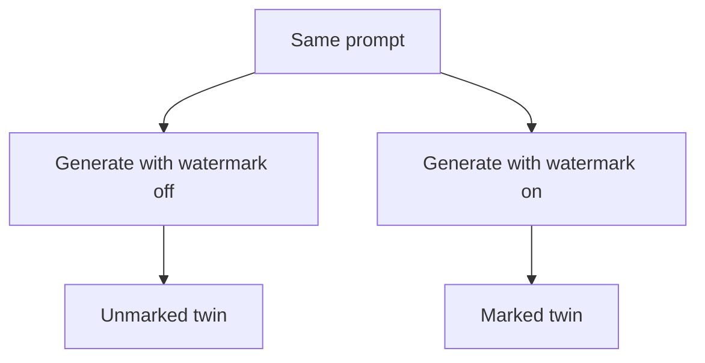
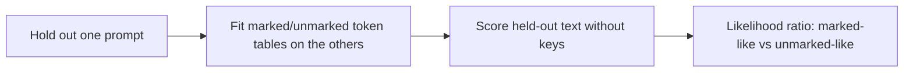

# text-watermark-laboratory

**text-watermark-laboratory** asks a practical question about statistical text watermarks:

> **Can we tell whether text carries a watermark even when we do not have the detector keys?**

On Google DeepMind's public SynthID-Text mixin (`public-deepmind-30`), with matched marked/unmarked twins: **yes, at prompt-group grain; not as a universal isolated-file detector.** Tournament sampling leaves a learnable footprint in next-token counts. A count-table likelihood ratio picks that up without keys, `hash_iv`, or g-values. This lab did not invent that research question.

| | Claim | Number | Not |
|---|---|---|---|
| 1 | Key-free last-4 count tables rank held-out prompt groups | **10/12** | Single-file accuracy |
| 2 | Same hits reader, 36 topics × 4 draws, in-domain | **36/36** | Cross-generator |
| 3 | Isolated hard sign, one marked file, `lr>0` | **29/48** | A 5% binomial test; not a calibrated detector |

Official keyed `score` on the original 12 twins is **12/12**. That path uses keys. It is the positive control.

**Mechanistic finding.** The in-domain mark is front-loaded. Scoring the first four generated tokens already ranks **34/36**, matching a 16-token prefix. Window **16:32** is near chance. The signal is a prefix-conditioned deformation of the local choice distribution, not a small bias that accumulates over a long file.

Ablations, hashed readers, rank-path, occupancy, and transfer tables: **[research/results-ledger.md](research/results-ledger.md)** and **[experiments/README.md](experiments/README.md)**. Later 39/48 and 41/48 figures on the same 12×4 files are hypothesis generators (occupancy, in-domain geometry, researcher reuse of one evaluation set). They do not replace **29/48**.

The next measurement is a frozen prediction on new prompts, not another scorer on the old twins: **[research/PROTOCOL-next.md](research/PROTOCOL-next.md)**.

Install: **[HOW-TO.md](HOW-TO.md)** · Notes: **[research/](research/)** · Agents: **[AGENTS.md](AGENTS.md)**

---

## Two different tasks

**Relative discrimination (10/12).** Leave one prompt family out. Fit marked and unmarked count tables on the rest. Score the held-out marked group against the held-out unmarked group. Hard last-4: **10/12**. A 0.02 comparison margin on *that same scorer* is 11/12; that is a robustness check, not the headline. `hits` (shared 4-grams only) and `hashpool` are **11/12** on the same twins; those are different methods.

**Single-text classification (29/48).** Same leave-one-out tables, sign of one file’s LR against 0, no twin. Hard last-4 marked `lr>0`: **29/48**. Unmarked `lr≤0`: **23/48**. Binomial P(≥29 | n=48, p=0.5) = 0.097. Ranking of the same LRs is AUC 0.626 (permutation p = 0.0075). That overlap is why 10/12 must not be read as per-file accuracy.

The code enforces the key-free claim: `BlindModel` carries `used_keys`, `used_hash_iv`, and `used_g_values`; the held-out decision never consults `detector_mean`.

---

## The controlled experiment

SynthID-Text does not insert hidden characters. The watermark changes **which next tokens are selected during generation**.



DeepMind's detector on those twins (keys on):

```text
unmarked ≈ 0.50
marked   ≈ 0.61–0.65
```

Key-free decision does not use those scores:



For held-out *groups*, the original last-4 tables work (**10/12**; **36/36** on 36×4). For one file’s hard sign at 0, not reliably (**29/48**).

---

## Commands

```bash
source .venv/bin/activate
python -m pytest tests/ -q

python -m text_watermark_tools score path/to/text.txt

python -m text_watermark_tools pair experiments/2026-08-17-grok-prompts \
  --out-dir experiments/pairs --max-new-tokens 128

python -m text_watermark_tools indicate holdout experiments/2026-08-17-pair-12x4 \
  --rotate --context-len 4

python -m text_watermark_tools indicate fit experiments/2026-08-17-pair-12x4 \
  --out-dir experiments/indicator-gpt2 --context-len 4

python -m text_watermark_tools indicate score path/to/text.txt \
  --tables experiments/indicator-gpt2
# n_used=0 is ABSTAIN, not unmarked.

python -m text_watermark_tools probe experiments/2026-08-17-pair-12x4 \
  --out-dir experiments/probe
```

- `score` reproduces the public DeepMind detector for `public-deepmind-30`.
- `indicate` asks whether text resembles the marked or unmarked side of a learned corpus **without those keys**.

More CLI: [HOW-TO.md](HOW-TO.md).

---

## Reference scoring

```text
instance=public-deepmind-30
ngram_len=5
```

A long text near 0.50 shows no measurable bias toward **that key set**. A marked sample from the same mixin typically scores around 0.61–0.65 here. This is a controlled research baseline, not a human-vs-AI classifier.

---

## Rewriting experiments

Known public mark, then rewrite, then `score` again:

- marked GPT-2 text: **0.617 / 0.638**
- light Sonnet proofread: **0.605 / 0.625**
- full Sonnet rewrite: **0.502 / 0.502**
- Qwen rewrite of a known marked sample: approximately **0.50**

These measure how a known watermark behaves under transformation. They are not the key-free indicator.

---

## Claude

Anthropic has announced text marking based on "a version of" SynthID-Text. Their production keys are not public. Claude is a future external test of the key-free method, not something `score` can read.

Pre-mark corpus: `experiments/claude-premark-2026-08/`. Notes: [research/claude.md](research/claude.md), [research/paired-corpus.md](research/paired-corpus.md).

---

## Related work

Canonical map: [research/related-work.md](research/related-work.md). Citations: [research/CITING.md](research/CITING.md).

Wang et al. (2026) (*TTP-Detect*) formulate third-party, key-agnostic verification from paired references — the same audit problem, a different method. Gloaguen et al. (2025) detect a watermarking scheme as a *generator property* with black-box queries. Omidi et al. (2026) analyse keyed SynthID scores. Duan et al. (2025) (*PVMark*) prove keyed detection in zero knowledge. Jovanović et al. (2024) is watermark stealing (arXiv 2402.19361), not Zhang et al. (2024) (arXiv 2311.04378).

What this repository adds is a small, fully checked-in instance on DeepMind’s **public** mixin. Treat it as an empirical notebook, not a priority claim. A fair later question is how much of TTP-Detect’s third-party audit a simple count/opening LR recovers on identical paired data — not whether this lab is “smarter.”

---

## Boundaries

> **On this public mixin, matched twins leave enough key-free statistical structure that a count-based indicator can rank most held-out prompt groups.**

That does not establish invention of the problem, reliable classification of every isolated paragraph, recovery of secret keys, or equivalence between `public-deepmind-30` and production systems from other vendors.

---

## Project layout

```text
AGENTS.md        coding-agent instructions
HOW-TO.md        installation and practical usage
research/        methods, protocol, results ledger
experiments/     dated runs and result artifacts
src/             score, pair, blind, indicate, iterate
```

Depends on [`google-deepmind/synthid-text`](https://github.com/google-deepmind/synthid-text). Not a fork.

Licensed under [MIT](LICENSE).
