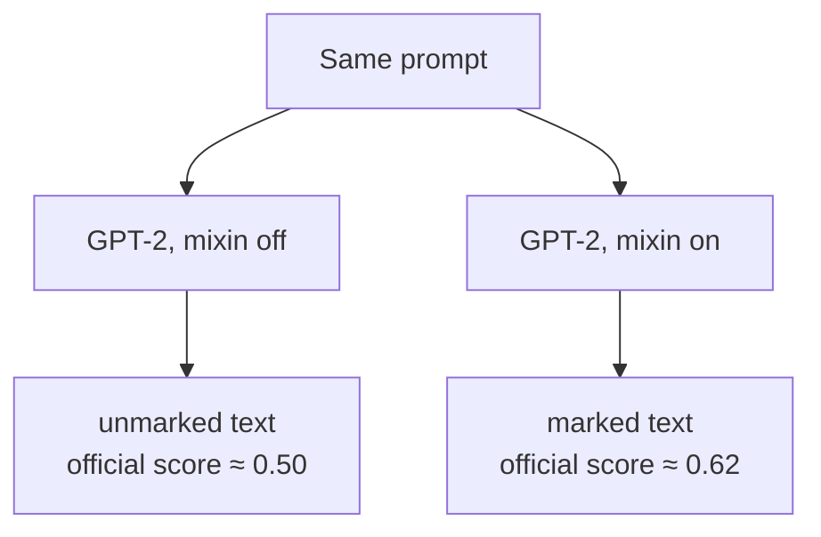
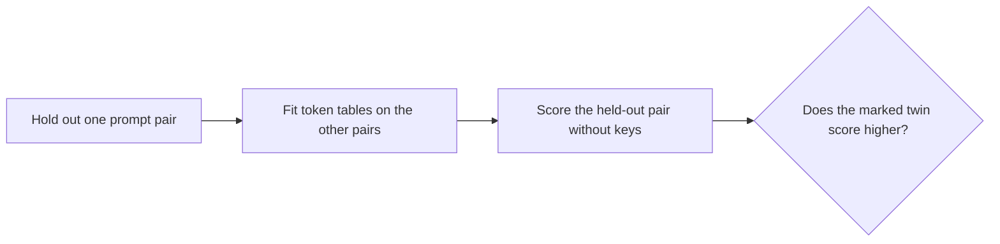

# text-watermark-laboratory

text-watermark-laboratory is an experimental research project for studying
[SynthID-Text](https://github.com/google-deepmind/synthid-text) and, in
particular, what can be measured about a watermark **without** its private
detection keys.

We use Google DeepMind’s public 30-key reference configuration
(`public-deepmind-30`, `ngram_len=5`) as a known baseline, then generate
matched marked and unmarked text from the same prompts. The research question
is simple: can a watermark leave statistically measurable traces even when the
detector’s keys are unavailable?

The experiments so far say **yes, when samples can be compared or aggregated**
— and **no, not reliably, for a single isolated text**. This is a research
repository, not a product. It is not affiliated with Google, DeepMind, or
Anthropic.

Install and first `score`: **[HOW-TO.md](HOW-TO.md)**.
New contributor / Grok session: **[AGENTS.md](AGENTS.md)**.

---

## Scope

### What it does

1. **Reference scoring.** Evaluate a text with DeepMind’s published
   `detector_mean` on instance `public-deepmind-30`. In this repo, “official
   score” means that function, not an endorsement.
2. **Key-free twin experiments.** From the same prompt, generate GPT-2 with
   the watermark mixin on and off. Fit a token-count surrogate on some pairs
   and test the held-out pair **without** calling `detector_mean`.
3. **Rewrite / degradation.** Take a text we *already know* is marked on this
   instance and rewrite it (Qwen or DeepSeek) until the official score sits
   near chance (≈ 0.50). That is a measurement, not a product that certifies
   anyone else’s detector will fail.

There is also a Claude **pre-mark corpus**
(`experiments/claude-premark-2026-08/`) so the *same* prompts can be rerun
after Anthropic announces marking. Our `score` on Claude text is the **wrong
instance**.

We depend on [`google-deepmind/synthid-text`](https://github.com/google-deepmind/synthid-text)
(Apache-2.0). We are not a fork and we do not reimplement the mean.

This repository is [MIT](LICENSE).

### What it does not do

- Classify human vs AI (not GPTZero, not “is this a person?”).
- Detect Claude, ChatGPT, Gemini production, or any unknown vendor mark.
- Recover keys or the SHA-256 IV from a string
  ([research/invertibility.md](research/invertibility.md)).
- Reliably classify one arbitrary paragraph without keys (29/48 on that test).
- Strip C2PA, Unicode stealth marks, or image-SynthID. Those are different
  marks.

A score ≈ 0.50 with enough n-grams means **not this key set**. It does not
mean “human” and it does not mean “Claude has no mark”.

---

## Method

SynthID-Text does not insert hidden characters. The mark is *which next token
the sampler chose*. You cannot invert the key from a finished string, and
without keys you cannot run official `score`. What you *can* do is generate
the same prompt twice.



The official detector is the reference measurement. The key-free test does
**not** use those scores when it decides which member of a pair looks marked.



1. Hold out one prompt pair.
2. Build token-frequency tables from the remaining pairs (no keys, no
   `hash_iv`, no g-values).
3. Score both held-out texts.
4. Count a hit if the marked twin ranks above its unmarked twin.
5. Repeat for every prompt.

Longer write-up: [research/key-free-twins.md](research/key-free-twins.md).

---

## Results

Twelve English seed prompts, 17 August 2026. Official scores on the new tokens
separate every twin (marked 0.61–0.65, unmarked ≈ 0.50). Example, harbour:
prompt 0.500, unmarked generation 0.508, marked **0.621**.

| Method | What was measured | Result |
|---|---|---|
| Official keys (`score`) | `detector_mean` on the public reference set | **12/12** |
| Key-free, 1 sample | Token counts, 12 prompts × 128 tokens | **8/12** |
| Key-free, 1 sample, 700 tokens | Same seeds, longer generations | **6/12** |
| Key-free, 4 samples | 12 prompts × 4 GPT-2 draws, last-4 context | **10/12** |
| Same + `--margin 0.02` | Hit if the marked twin may trail by 0.02 | **11/12** |
| Local Qwen2-1.5B, last-2 | Same protocol, different generator | **10/12** |
| One isolated file (`indicate`) | Frozen last-4 tables, `lr > 0` on a held-out marked file | **29/48** |

Misses at 10/12 (both `blind` and `indicate` rotate): *station* and *office*.
The 0.02 margin brings station in (gap 0.010). Office still misses by 0.066 —
that one is not close.

**What this supports:** under matched prompts, repeated watermarked generation
can produce statistical structure that is measurable without the keys
(10/12–11/12 at prompt grain).

**What this does not support:** reliable key-free detection of an arbitrary
isolated text (29/48). Extra draws of the *same* prompt helped. Extra topics
and extra length, by themselves, did not.

Runs: [experiments/2026-08-17-blind-12x4-k4/](experiments/2026-08-17-blind-12x4-k4/),
[experiments/2026-08-17-indicate-holdout-12x4/](experiments/2026-08-17-indicate-holdout-12x4/).

Earlier GPT-2 mixin measurements (same public keys): marked T 0.617 / 0.638;
light Sonnet proofread 0.605 / 0.625; full Sonnet rewrite 0.502 / 0.502;
key-free rewrite of a known-marked sample ~0.50.

These numbers are from GPT-2 (or local Qwen2-1.5B) plus this public mixin.
They do not establish the same behaviour for other models, languages, or
vendor watermarks.

---

## CLI

```bash
source .venv/bin/activate
python -m pytest tests/ -q

# Reference score (this instance only)
python -m text_watermark_tools score path/to/text.txt
python -m text_watermark_tools score path/to/dir_of_txts
python -m text_watermark_tools score path/to/text.txt --control-shuffled-keys

# Matched twins
python -m text_watermark_tools pair experiments/2026-08-17-grok-prompts \
  --out-dir experiments/2026-08-17-blind-pairs --max-new-tokens 128

# Key-free leave-one-out
python -m text_watermark_tools blind experiments/2026-08-17-blind-pairs \
  --out-dir experiments/blind

# One file against frozen tables (weak tilt, not the official score)
python -m text_watermark_tools indicate fit experiments/2026-08-17-pair-12x4 \
  --out-dir experiments/indicator-gpt2 --context-len 4
python -m text_watermark_tools indicate score path/to/text.txt \
  --tables experiments/indicator-gpt2

# Rewrite a known-marked file until this instance is near 0.50
cp DASHSCOPE-KEY.conf.example DASHSCOPE-KEY.conf   # gitignored
python -m text_watermark_tools iterate path/to/marked.txt --backend qwen \
  --out-dir experiments/iterate
```

Every `score` line names the instance (`instance=public-deepmind-30
ngram_len=5`). Mean / weighted mean well above 0.50, with many unmasked
n-grams, means bias in **this** key set.

---

## Dependencies

Pin **`transformers==4.57.6`**. DeepMind’s tree asks for 4.43.3; a small shim
in `generate.py` keeps their mixin working on current 4.x. Transformers 5.x
was tried: the mixin runs, but GPT-2 hits EOS before `min_new_tokens`, so
`pair` does not get enough n-grams. Three Dependabot alerts remain; they are
fixed only in 5.x (`Trainer`, a remote-load path, LightGlue) and this lab
does not use those paths.

```text
CPU JAX  +  pip install -e <synthid-text-checkout> --no-deps
```

Street-level setup: [HOW-TO.md](HOW-TO.md).

API keys for rewrite experiments live in `DEEPSEEK-KEY.conf` /
`DASHSCOPE-KEY.conf` (gitignored) or the environment. Never on argv. Never in
tracked files. Example files stay empty. If a secret lands in git, delete it
and rotate the key.

---

## Layout

```
AGENTS.md        project rules
HOW-TO.md        install, score a file, read the line
research/        invertibility, twins, Claude, paired corpus
experiments/     dated runs + claude-premark-2026-08/
src/             score, pair, blind, indicate, iterate
```

Related code we read but did not vendor:
[MarkLLM](https://github.com/THU-BPM/MarkLLM),
HF’s SynthID training example,
and various Unicode / C2PA / image-SynthID cleaners (orthogonal to this mark).
